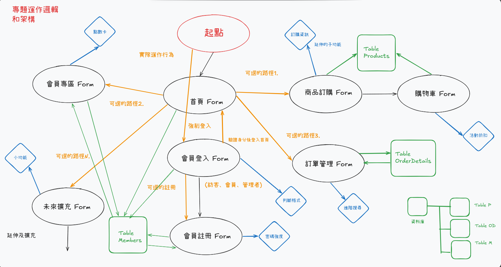
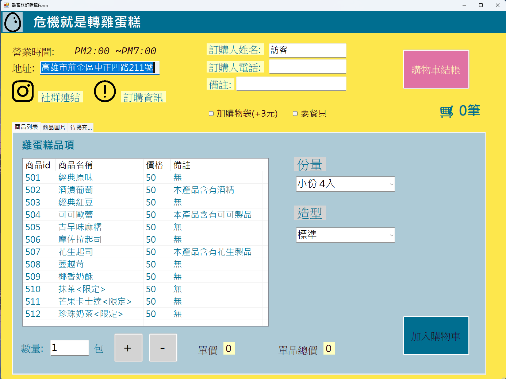

# 🧁 WinForms 訂購系統專案

這是一個使用 C# Windows Forms 開發的練習專案，主要模擬雞蛋糕訂購與會員系統流程。
----

## 📌 專案功能

- 👤 會員註冊 / 登入
- 🏠 首頁導覽系統
- 🛒 商品瀏覽與訂購
- 📦 購物車功能
- 📊 訂單管理
- 🔐 權限判斷（訪客 / 會員 / 管理者）
----

## 🧭 系統架構圖

----

## 🛠 技術使用

- C#（WinForms）
- SQL Server（資料庫）
- ADO.NET（資料存取）
----

## 🚀 專案說明

此專案主要練習：

- 表單之間的流程設計
- 資料庫 CRUD 操作
- 使用者權限控管
- UI 與邏輯分離的基礎概念
----

## 📎 備註

此專案為學習用途，後續會持續擴充功能與優化架構。
----

## 🧭 實機執行畫面

### 畫面 商品瀏覽與訂購

